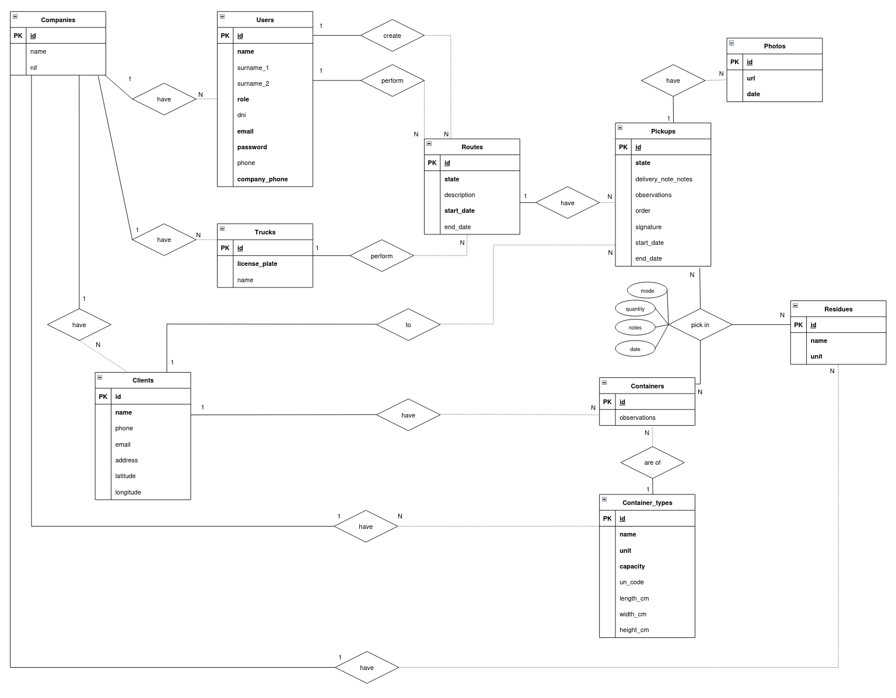
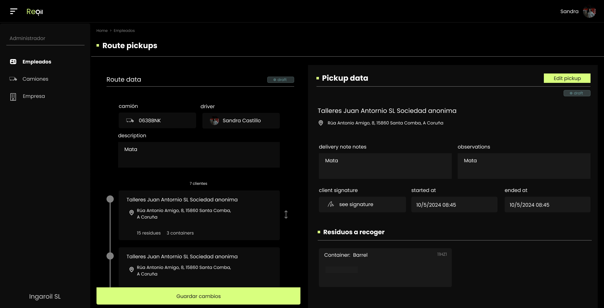
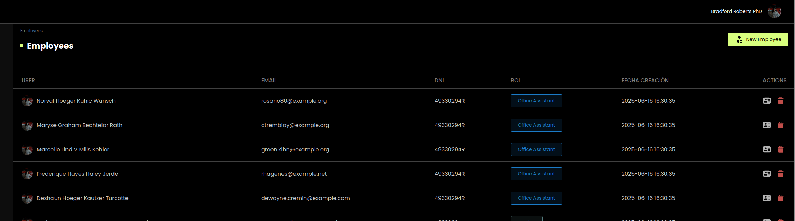

# Deseño

## Diagrama da arquitectura

## Diagrama de Base de Datos

## Deseño de interface de usuarios

Presentase o deseño da aplicación en movil, o cal servirá de base para facer a aplicación de navegador. Este deseño pertenece a interfaz de un usuario camionero, o cal pode ver as rutas asignadas ao seu camión e actualizar os datos de recollida.

[Figma](https://www.figma.com/design/AEmPZPp5FDMhzTxkp7kCSN/Untitled?node-id=0-1&t=4sBBOJu9HyCbwu6p-1)

### Paxina presentación da aplicación
[Figma](https://www.figma.com/design/AEmPZPp5FDMhzTxkp7kCSN/Untitled?node-id=168-16&t=amkkqKePpYtFl8yp-1)

### Paxina administración e oficina
[Figma](https://www.figma.com/design/AEmPZPp5FDMhzTxkp7kCSN/Untitled?node-id=179-72&t=amkkqKePpYtFl8yp-1)

Amosanse algunhas das páxinas:

