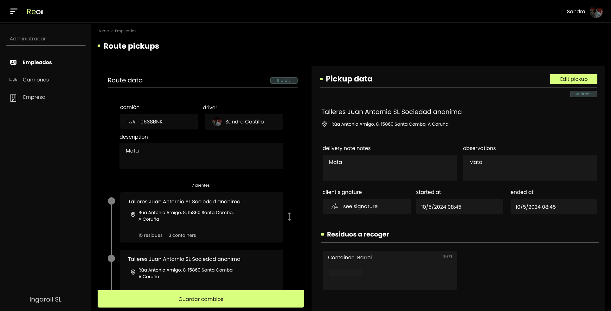

# Codificación e Probas

## Codificación
A continuación indico algúns dos problemas cos que me encontrei no desarrollo:

### Docker
Montar o entorno de desarrollo doume problemas durante días, xa que a aplicación tiña uns tempos de resposta nefastos e ferramentas como o entorno de desarrollo de Vite
non me funcionaban.

Intentei optimizar todos os ficheiros de Docker para conseguir que funcionase pero foi imposible. A única solución foi instalar ubuntu no meu entorno de desarrollo, a partir de ahí todo funcionou a perfección sen facer ningún tipo de cambio.

Parece ser que todo esto debese a que docker en windows necesita unha maquina virtual linux intermedia para funcionar, polo que o acceso a ficheiros en volumenes relentiza todo o sistema, entre outras moitas cousas.

### Problema autenticación e api
Ao inicio da aplicación, todas as paginas funcionaban mediante formularios html, xa que eran un simple CRUD, polo que a autenticación para realizar estas peticións era sempre mediante sesions.

A medida en que a aplicación avanzou, pantallas como a de creación de ruta volvianse demasiado complexas para un simple formulario, necesitaba usar peticións ajax para facer o gardado de datos.

Xa tiña en mente facer unha api para a aplicación de android, polo que planifiquei que a api valera tanto para android como para a aplicación web. Esto fixo que me xurdira un problema coa autenticación do usuario, debido a que debían funcionar con metodos distintos:

Android
A autenticación en android sería mediante tokens de acceso, o cal tería o seguinte funcionamento:

O usuario manda unha petición para loguearse.
O servidor recibe as credenciales e comproba que son correctas.
Xenera un token para ese usuario e gardao na base de datos con encriptación.
Responde a petición de login co novo token xerado (non encriptado).
A aplicación android recibeo e gardao para usar en todas as próximas peticións a api.
Web
Dende a aplicación web deime de conta de que este metodo non funcionaría moi ben.

A primeira idea que se me ocorreu foi: "Estou seguro de que podo obter os tokens de acceso para ese usuario con algo como $user->getTokens() e no momento de xerar a vista no servidor meter o token no header de todas as peticións ajax que fago nesa páxina". Obviamente non funcionaba, os tokens estaban cifrados na base de datos e o único momento no que se podía ver o token en texto plano era cando se xeraba un novo, polo que ou xeraba un token novo para ese usuario en cada petición, ou o gardaba en sesión e reutilizaba o mesmo durante toda a sesión. Ningunha das idea me acababa de convencer, ambas seguían facendo unha xeneración excesiva de tokens.

Solución
Usando Laravel Sanctum, podense configurar as rutas de api para que usen sesións en vez de acceso mediante token para todas as peticións que proveñan de dominios especificos.

Indico os dominios na configuración:
```php
/*
|--------------------------------------------------------------------------
| Stateful Domains
|--------------------------------------------------------------------------
|
| Requests from the following domains / hosts will receive stateful API
| authentication cookies. Typically, these should include your local
| and production domains which access your API via a frontend SPA.
|
*/

    'stateful' => explode(',', env('SANCTUM_STATEFUL_DOMAINS', sprintf(
        '%s%s',
        'localhost,localhost:3000,127.0.0.1,127.0.0.1:8000,::1',
        Sanctum::currentApplicationUrlWithPort(),
        // Sanctum::currentRequestHost(),
    ))),
```
Doulle acceso a eses dominios para autenticarse mediante sesion, modificando o arquivo boostrap/app.css:
```php
$middleware->statefulApi();
```
Header para facer unha petición usando sesions, incluindo o token csrf:
```php
credentials: 'same-origin',
headers: {
'X-Requested-With': 'XMLHttpRequest', // identify as AJAX
'X-CSRF-TOKEN': document.querySelector('meta[name="csrf-token"]').getAttribute('content'),
}
```
De esta maneira, as petición que proveñan dos dominions indicados na configuración, usarán a sesión para autenticarse, mentras que as demais peticións usarán tokens.

## Prototipos
### Login e páxina de presentación
As primeiras páxinas en ser diseñadas e codificadas forón as de login e presentación da aplicación, con un tempo estimado de 3 días. Con estas, tamen se empezaron a deseñar os primeiros compoñentes que usaría ao longo da aplicación.


### Crud de modelos da base de datos
A seguinte fase do proxecto centrouse en ter todas as páxinas de creación e listado das entidades da base de datos.
Crearonse case todos os compoñentes que se usarían ao longo de toda a aplicación e refinouse o esquema relacional da base de datos.


### Creación de rutas e api REST
Na última fase, introduciuse a autenticación mediante token e crearonse os servidos api. Tamen se desenvolveron as distintas pantallas de creación e seguimento de rutas.



## Innovación
Para a aplicación web usaronse varias tecnoloxías non vistas no ciclo, tanto para o backend como o frontend. 

No backend utilizouse `Laravel`, un framework de php o cal trae xa de base moitas axudas para empezar a facer unha aplicación web.
Antes de empezar a realizar o proxecto, formeime durante varias semanas no framework, basandome en tutoriais e documentación oficial, axudandome tamen de IA. Durante eses días realicei pequenos proxectos para ter unha base sólida e comezar a aplicación intentando aplicar os mellores patróns de deseño para o framework en cuestión, ainda que moitos de estes conceptos xa os trataramos no ciclo.

Para o front usei `laravel blade` con compoñentes, xunto con `tailwind` e `javascript vanilla`. Resultoume bastante comodo traballar con tailwind, sobretodo compoñetizando os elementos das pantallas para poder reusalos. Nun futuro espero ampliar as ferramentas usadas e incluir `Livewire` e `Alpinejs`, xa que axilizarían moito o desenvolvemento. Tendo unha base solida de css, o paso a tailwind e compoñentes fixoseme moi levadeiro, sobretodo maquetando a interfaz en Figma, o cal acelerou as fases de implementación. 

## Probas
Durante o desenvolvemento realizáronse probas manuais en cada funcionalidade implementada. Estas incluíron:

* Verificación do comportamento das rutas e controladores.

* Comprobación da persistencia de datos na base de datos.

* Probas da autenticación con sesións e tokens.

* Validación da resposta das APIs desde ferramentas como Postman.

* Probas no frontend para comprobar a integración entre compoñentes e backend, tanto con formularios como con chamadas AJAX.

Ainda que non se empregaron probas automatizadas por cuestións de tempo, a aplicación foi validada funcionalmente a través de múltiples escenarios reais e casos de uso.